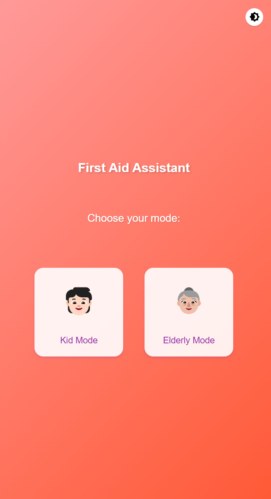
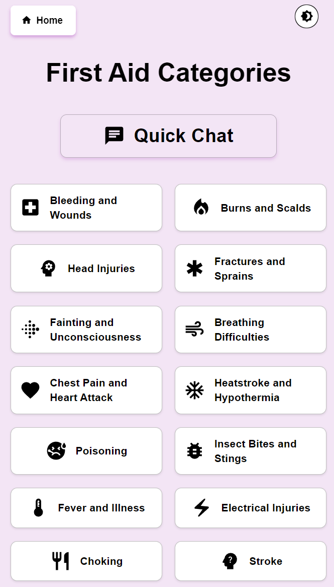
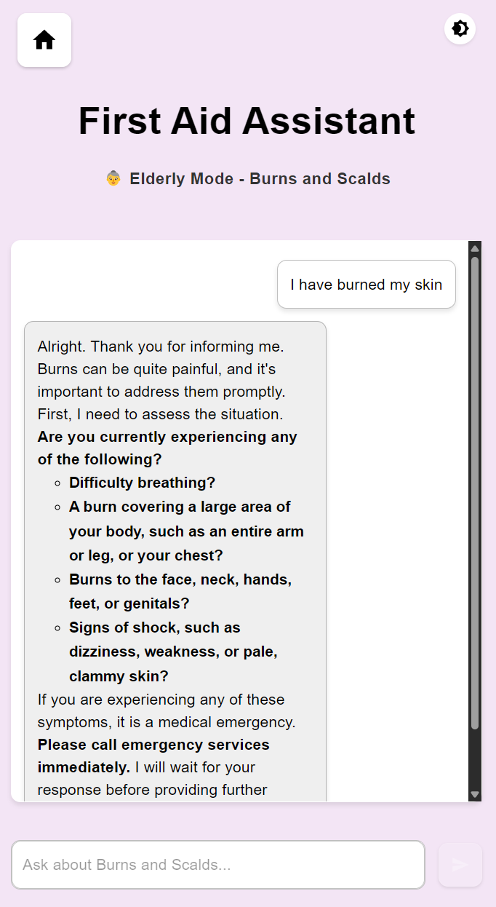
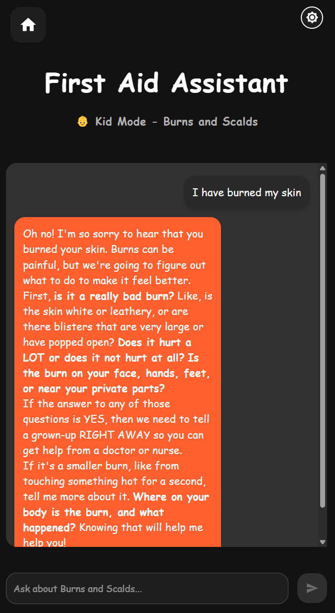

# Easy First Aid

A web application that provides AI assisted first aid guidance designed for clarity, accessibility, and ease of use. It helps children and older adults receive reliable instructions during common emergency situations.


---

## Preview

<p align="center">
  
  
  
  
</p>

---

## Overview

Easy First Aid provides step by step instructions for common first aid situations through an accessible interface. It uses Google Generative AI to deliver clear, context aware guidance. The platform supports both voice and text based interaction to support users with varied needs.

---

## Architecture

```
EasyFirstAid/
├── frontend/   # React + TypeScript + Vite + Material UI
└── backend2/   # Node.js + Express + Google Generative AI
```

- Frontend: React based interface with TypeScript and Material UI, built for readability and accessibility.
- Backend: Express server calling Google Generative AI to generate structured responses.
- Security: Environment variables managed through .env, with CORS and API key isolation.

---

## Quick Start

### Prerequisites
- Node.js (LTS)
- npm
- Google Generative AI API Key

### Run Locally

```bash
# Frontend
cd frontend
npm install
npm run dev

# Backend
cd backend2
npm install
npm run dev
```

Frontend runs at: http://localhost:5173  
Backend runs at: http://localhost:3000

---

## Environment Setup

Create a .env file inside backend2:

```
GEMINI_API_KEY=your_api_key_here
PORT=3001
```

Keep .env files private. Do not commit them to version control. Use an .env.example file to document required variables.

---

## Tech Stack

| Layer | Tools |
|-------|--------|
| Frontend | React 19, TypeScript 5, Vite, Material UI 7, React Router 7 |
| Backend | Node.js 20, Express 5, Google Generative AI, dotenv, CORS, body-parser |

---

## Key Features

- Designed for accessibility and ease of understanding.
- AI assisted instructions using Google Generative AI.
- Modular and scalable full stack structure.
- Secure configuration management with isolated API keys.

---

## Future Enhancements

- Voice assisted question and response flow.
- AI based image analysis for injury identification.
- Offline capable mobile PWA.
- Additional language support.

---

Developed by Sita Vaibhavi Gunturi  
